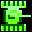
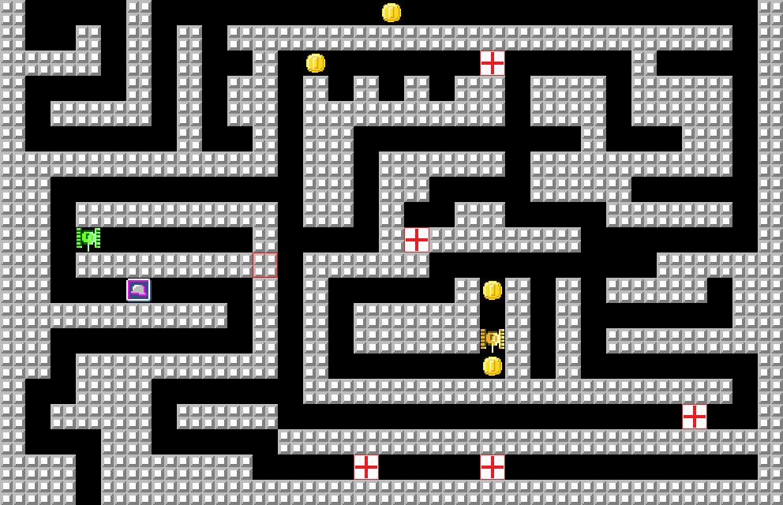
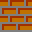

# ИГРА "ТАНЧИКИ"  
___
**Танчики -** игра для двух человек, в которой игроки управляют своими танками.
Можно играть в команде против множества врагов с искусственным интеллектом или друг против друга.

## Модули
**Для игры необходимо установить некоторые модули:**
  * **[pygame](https://pypi.org/project/pygame/)**
  * **[pygame-menu](https://pypi.org/project/pygame-menu/)**
  * **[keyboard](https://pypi.org/project/keyboard/)**
  * **[colorama](https://pypi.org/project/colorama/)**
___
## Установка
`pip install requirements.txt`

## Карта
**Карта -** главная часть игры. На ней проходят танковые битвы. Она состоит из блоков, бонусов и мин.

### Средство создания карт
  Чтобы создать свою карту, используйте красный квадрат который находится на экране.
#### управление
* **движение**
    * **Вперёд -** *t*
    * **Назад -** *g*
    * **Влево -** *f*
    * **Вправо -** *h*
* **блоки**
  * **Убрать блок в квадрате -** *z*
  * **Поставить кирпичный блок в квадрате -** *x*
  * **Поставить бронированный блок в квадрате -** *a*
  * **Поставить суперзолотую монету в квадрате -** *d*

### Блоки
* **Бронировaнный блок -** разрушается только супервыстрелом. 
* **Кирпичный блок -** разрушается любым выстрелом. 
### Параметры
* **Здоровье -** количество единиц здоровья танка.
* **Броня -** число, которое вычитается из урона при попадании снаряда в танк.
* **Урон -** число, которое вычитается из здоровья другого танка при попадании в него снаряда.
* **Снаряды -** количество снарядов танка.
* **Бронебойные снаряды -** снаряды из урона которых не вычитается броня.
* **Деньги -** за деньги можно покупать **некоторые** параметры.
* **Взрывоустойчивость -** защита танка от мин.
* **Убийства -** количество убитых танков противника этим танком.
* **Задержка телепортации -** задержка между телепортациями.
* **Задержка стрельбы -** задержка между выстрелами.

### Бонусы
* **Золотая монета -** увеличивает количество монет танка на 1. 
* **Суперзолотая монета -** увеличивает количество монет танка на 50. 
* **Здоровье -** увеличивает здоровье танка на 100. 
* **Броня -** увеличивает броню танка на 100. 

## Управление
* **ТАНК 1**
  * **Движение**
    * **Вперёд -** *стрелка вверх*
    * **Назад -** *стрелка вниз*
    * **Влево -** *стрелка влево*
    * **Вправо -** *стрелка вправо*
  * **Стрельба**
    * **Обычный выстрел -** *space*
    * **Замораживающий -** *c*
    * **Бронебойный -** *v*
    * **Супервыстрел -** *alt*
  * **Телепортация**
    * **Обычная телепортация -** *n*
    * **Телепортация за спину -** *enter*
    * **Телепортация в квадрат -** *точка*
    * **Телепортация за карту -** *b*
  * **Невидимось -** *зажать ctrl*

* **ТАНК 2**
  * **движение**
    * **Вперёд -** *8*
    * **Назад -** *5*
    * **Влево -** *4*
    * **Вправо -** *6*
  * **Стрельба**
    * **Обычный выстрел -** *7*
    * **Замораживающий -** *минус*
    * **Бронебойный -** *0*
    * **Супервыстрел -** *3*
  * **Телепортация**
    * **Обычная телепортация -** *9*
    * **Телепортация за спину -** *+*
  * **Невидимось -** *зажать 1*
* **Карта**
  * **Добавить бонус -** *запятая*
  * **Добавить мину -** *shift + l*
  * **Oчистить карту -** *delete*
  * **Oткрыть карту -** *r*
  * **Сохранить карту -** *esc*
  * **Создать танчик 1 с ИИ -** *f1*
  * **Создать танчик 2 с ИИ -** *f2*
  * **Зайти в магазин -** *s + h*

